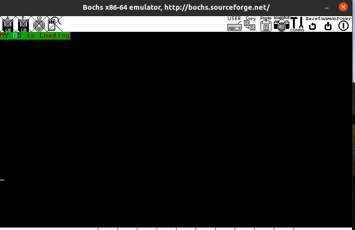
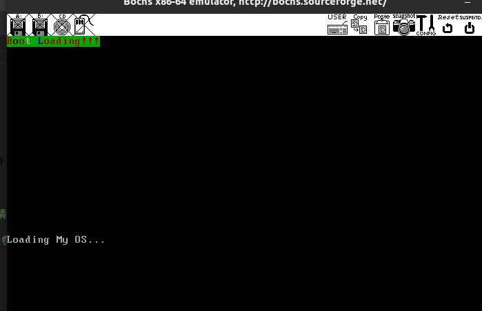

# MBR 完善

## 地址 section vstart

### 地址

地址只是一个数字，用与记录各种描述符号在源文件中的位置，是偏移文件开头的距离。
第 n 个数据所在的位置是数据 n-1 的偏移 + n-1 的内存空间。

### section

section 被称为节，是编译器提供的关键字，用于在程序中宣称一个区域。通过此关键字可以人为的将程序中的数据，指令放在不同的 section 中，使代码的结构更加明了。

用法
> section.节名称（data\code）.start

关键字 section 本身对于程序的地址没有任何影响，section 中的地址是整个文件的顺延续，仅仅用于逻辑上对开发人员梳理使用

### vstart

vstart 是虚拟起始地址，为 section 内的数据指定一个虚拟起始地址，告诉编译器一新的地址作为后面数据的起始值，它本身并没有改变数据本身在文件中的地址，通过加载器才会将数据加载到 vstart 指定的位置。

编译器只负责为程序编址，并不负责加载，加载由 BISO 加载到对于的物理地址

## CPU的实模式

### 实模式下的寄存器

<strong>通用寄存器</strong>

| 寄存器 | 助记名称 | 描述 |
| :---- | ----: | ---- |
ax | 累加器(accumulator) | 使用频率最高，算术运算，逻辑运算，保存和外设输入\输出数据
bx | 基址寄存器（base）| 存储内存地址，用此地址作为基址，用于遍历一片内存区域
cx | 计数器（counter）| 计数，循环指令中控制循环次数
dx | 数据寄存器（data）| 存放数据，通常之用于保存外设控制器的端口地址
si | 源变址寄存器（source index ）| 常用于字符串操作中的数据源地址，即被传送的数据在哪里
di | 目的变址寄存器（destination index）| 和 si 一样，用于字符串操作，但是 di 是表示数据被传说到哪里
sp | 栈指针寄存器（stack pointer)| 其段基地址是 SS ，用来指向栈顶，随着栈中的数据 push 和 pop 会修改sp的值
bp | 基址指针（base pointer）| 两种访问栈的模式，一种是用 push 和 pop 指令操作栈，这个时候sp 指针的值会自动更新，但是我们只能获取栈顶指针 sp 指向的数据。 另一种是把栈当成数据段来访问，通过 bp 寄存器，bp 的默认段寄存器是 SS ，通过 SS：bp 的方式当成普通数据段来访问

## 显示器操作

### IO接口

因为 CPU 与外设的速度不匹配，信号不同等原因，在 CPU 与外设之间 添加了一层 I/O 接口的设计方便了外设与 CPU 之间的联系

<strong>I/O接口功能</strong>

1. 设置速度缓冲，解决 CPU 与外设之间速度不匹配的问题
2. 设置电平转换信号
3. 设置数据格式转换
4. 设置时序控制电路来同步 CPU 和外设
5. 提供地址译码

<strong>端口操作指令</strong>

- 从端口读数据(in)
  
  1. in al,dx
  2. in ax,dx
  
  al (8位) 和 ax (16位)用于存储从端口获取的数据，dx 是端口号

- 写数据到端口(out)
  
  1. out dx，al
  2. out dx,ax
  3. out 立即数,al
  4. out 立即数,ax

### 显卡

<strong>显存的地址分布</strong>

| 起始  |  结束  |  大小  |  用途  |
| :---- | ----: | :----: | ---- |
C0000 | C7FFF | 32K | 显示适配器BIOS
B8000 | BFFFF | 32K | 文本模式
B0000 | B7FFF | 32K | 黑白模式
A0000 | AFFFF | 32K | 彩色模式

<strong>字符属性</strong>

每个在屏幕上显示的字符都占用两个字节，低字节是用于字符的 ASCII ，高字节是用于字符的属性信息 ;

高字节的低四位是字符的前景色（IRGB），高四位是字符的背景色（KRGB），I ：控制是否高亮，K ：控制是否闪烁

故可以通过RGB的组合来达到控制显示的字符颜色的功能（000：黑;001：蓝; ...）

## 直接操作显卡

- 对显卡的文本模式的地址进行操作，写入 “MY OS is Loading”

- 结果图



图象闪烁显示，此处只截取了显示字符的时候的截图

## Bochs调试

## 硬盘介绍

<strong>硬盘控制器主要端口寄存器</strong>

| IO 端口 |   | 端口用途| |
| :---- | ----: | :----: | ---- |
| Primary 通道 | Secondary 通道 | 读操作 | 写操作 |
 Command Block registers(命令)
0x1F0 | 0x170 | Data | Data
0x1F1 | 0x171 | Error| Features
0x1F2 | 0x172 | Sector count| Sector count
0x1F3 | 0x173 | LBA low | LBA low
0x1F4 | 0x174 | LBA mid | LBA mid
0x1F5 | 0x175 | LBA high | LBA high
0x1F6 | 0x176 | Device | device
0x1F7 | 0x177 | Status | Command
Control Block registers（控制）
0x3F6 | 0x376 | Alternate status| Device Control

- 硬盘读写
  - CHS mode: Cylinder / Head /Sector （柱面/磁头/扇区）--->对于磁头比较直观，但对于用户不直观
  - LBA mode: Logical Block Address（more convenience）--->对于用户更加直观
    - LBA28：用28bit来描述一个扇区的地址，最大寻址范围：2^28 = 268435456 个扇区，每个扇区大小为 512 Byte,故最大支持 128 GB
    - LBA48： 用48bit来描述一个扇区的地址，最大寻址范围：2^48 = 281474976710656个 扇区，最大支持 131072TB
- LBA 寄存器
  - LBA low ：存储 28 位地址的第 0～7 位
  - LBA mid ：存储 28 位地址的第 8～15 位
  - LBA high ：存储 28 位地址的第 16～23 位
   剩下的 24～27 位存储在<strong> device 寄存器的低四位</strong>

* device 寄存器

    这是一个杂项寄存器,不仅用于存储 LBA 的 24～27 位 并且存储通道上的主/从盘，启用 LBA 方式 ...
  - 0~3: LBA 地址的 24～27 位
  - 4：指定通道上的主盘(0)/从盘(1)
  - 6：启用LBA 模式 LBA (1)/CHS(0)
  - 5和7：固定为 1 ，称为 MBS 位

- status 寄存器

    用于给出硬盘的状态信息
  - 0：ERR位，置 1 表示命令出错
  - 3：DRQ位 ，置 1 表示准备好数据，随时可以输出
  - 6：DRDY位 ，置 1 表示设备就绪，等待指令
  - 7：BSY位 ，置 1 表示硬盘正忙

- Command 寄存器

    让硬盘执行命令
  - identify: 0xEC,硬盘识别
  - read sector: 0x20,读扇区
  - write sector: 0x30,写扇区

### 常用硬盘操作

<strong>读写步骤</strong>

1. 选择通道，往该通道的 sector count 寄存器中写入待操作的扇区数
2. 往该通道上的三个 LBA 寄存器写入扇区起始地址的低 24 位
3. 往 device 寄存器中写入 LBA 地址的第 24～27 位，并置第 6 位为 1 ，使其为 LBA 模式，设置第 4 位，选择操作的硬盘（master/slave）
4. 往该通道上的 command 寄存器写入操作命令
5. 读取该通道上的 status 寄存器，判断硬盘工作是否完成
6. 如果是执行读硬盘，则执行下一步骤，否则结束
7. 将硬盘数据读出

<strong>数据传输方式</strong>

1. 无条件传送方式
2. 查询传送方式
3. 中断传送方式
4. 直接存储器处理方式（DMA）
5. I/O 处理机传送方式

### 利用 MBR 使用硬盘

 负责从硬盘上把 loader 加载到内存，并将管理权交给 loader


<strong>代码详解</strong>

- %include :nasm编译器的预处理指令<===> 同 c 中的 #include
- LOADER_BASE_ADDR equ 0x900 宏定义，loader 会在内存地址 0x900 处 ; 宏名 equ 值 <===> c 中的#define 宏名 值
- LOADER_START_SECTOR equ 0x2 宏定义，loader 放在第二个扇区
- rd_disk_m_16（在16位模式下读硬盘） 函数详解
  - 先通过 eax，bx，cx 三个寄存器传递函数所需的参数表示：扇区开始处，扇区地址，扇区的个数
  - call ; 指令是对函数的调用 <===> ret 是函数的返回
  - esi 和 di ; 分别暂存扇区开始处和扇区数
  - mov dx，0x1f2 ; 选择通道
  - mov al,cl     ; cl是cx的低八位，保存扇区数  
  - out dx,al   ; 往 sector count 写入扇区数
  - mov eax,esi  ; 恢复 ax
  - mov dx,0x1f3 ; 操作端口 0x1f3（LBA low）
  - out dx,al  ; al 是eax的低8位存入地址信息，写入端口
  - mov cl,8 
  - shr eax,cl    ; 逻辑右移8位（低 8 位的地址信息已经被写入寄存器，此处是写入8～15位地址信息），将8～15位的数据移到低 8 位
  - mov dx,0x1f4 ; 操作端口 0x1f4（LBA mid）
  - out dx,al   

  - shr eax,cl    ; 再次逻辑右移 8位，
  - mov dx,0x1f5  ; 操作端口 0x1f5（LBA high）写入16～23位地址信息
  - out dx,al

  - shr eax,cl      ; 再次逻辑右移 8位,地址信息 24~27位 移动至 0~3 位
  - and al,0x0f     ; 01111 | LBA的 24～27 位信息，===> 24~27 位信息存入al
  - or al,0xe0      ; 设置7～4 位为 1110,表示 LBA 模式
  - mov dx,0x1f6    ; 操作端口 0x1f6（device）写入 LBA 模式和 LBA 的 24～27 地址信息
  - out dx,al

  - mov dx,0x1f7    ; 操作端口 0x1f7（command端口）写入读扇区命令
  - mov al,0x20
  - out dx,al

### 内核加载器

- 写内核加载器 loader
- 将loader 写入硬盘
- 在主引导扇区读入
- 检测正确性
- 跳转到 loader 执行


实模式下print函数

```s
mov si,booting  ; 参数 si （打印的字符串）
call print  ; 调用 print
print：
    mov ah，0x0e    ; ah 为0xe al为字符 int 0x10 打印字符
.next:      ; 逐个打印字符
.next:
    mov al,[si]
    cmp al,0
    jz .done  ; 字符串没数字时结束
    int 0x10  ; 调用中断
    inc si  ; 自增
    jmp .next

.done :
  ret ; 字符串
; 填充打印的字符串
booting:
  db "Booting to Os...",10,13,0 ; \n\r《===》10和13(ASCII码)
```


- 结果图

通过 MBR 执行到 loader,并且输出字符



<strong>实模式的内存布局</strong>

| 起始地址 | 结束地址 | 大小 | 用途 |
| :---- | ----: | :----: | ---- |
0x000|0x3ff|1KB|中断向量表
0x400|0x4FF|256B|BIOS 数据区
0x500|0x7BFF|29.75KB|可用区域
0x7C00|0x7DFF|512B|MBR 加载区域
0x7E00|0x9FBFF|607.6KB|可用区域
0x9FC00|0x9FFFF|1KB|扩展 BIOS 数据区
0xA0000|0xAFFFF|64KB|彩色显示适配器
0xB0000|0xB7FFF|32KB|黑白显示适配器
0xB8000|0xBFFFF|32KB|文本显示适配器
0xC0000|0xC7FFF|32KB|显示适配器 BIOS
0xC8000|0xEFFFF|160KB|映射内存
0xF0000|0xFFFEF|64KB-16B|系统 BIOS
0xFFFF0|0xFFFFF|16B|系统 BIOS 入口

